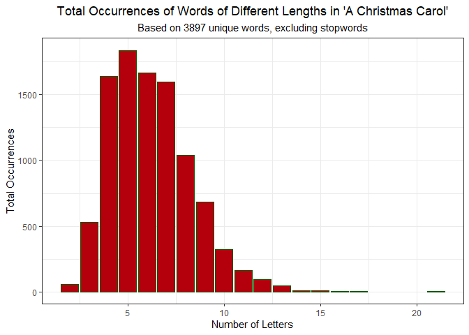
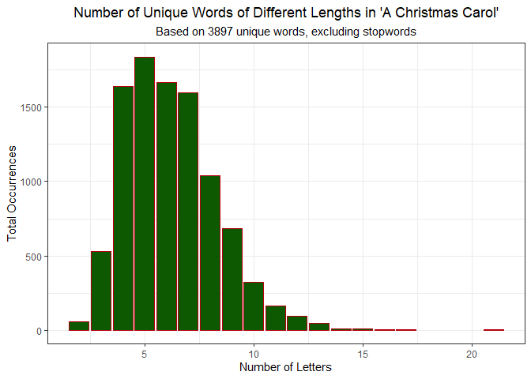

A Dickensian Analysis
================

In the spirit of the holidays, we will be analyzing the frequency of
words of different lengths in the book *A Christmas Carol* by Charles
Dickens.

We will analyze this book by reading the data from a plaintext (.txt)
file containing the content of the book, which is sourced from [Project
Gutenberg](https://dev.gutenberg.org/).

In particular, our data will be collected by directly reading from the
[“Plain Text UTF-8”](https://dev.gutenberg.org/ebooks/46) text file on
the Project Gutenberg website.

``` r
library(tidyverse)
library(tidytext)
```

# Reading in Data

Using the `read_lines` function from the `readr` library, we can create
a vector in R which contains the entirety of *A Christmas Carol* by
reading in the text from the book line-by-line. The advantage of using
the `read_lines` to read in the book as opposed to a different function
such as \``readr::read_file` is that the function automatically handles
‘invisible’ characters such as newline characters (`\n`) and carriage
returns (`\r`) which are present at the end of (almost) every line in
the .txt file.

``` r
# Read in the book line-by-line using readr
christmascarol <- read_lines("https://dev.gutenberg.org/cache/epub/46/pg46.txt")
```

# Data Tidying

Before we can analyze the words in *A Christmas Carol*, we need to tidy
the dataset to ensure that the data which we have read in is suitably
prepared for analysis.

## Checking the Beginning and Ending

First, we will look at the first 10 and last 10 lines of the book to
check whether everything has been read into R properly.

``` r
head(christmascarol, n = 10)
```

     [1] "The Project Gutenberg eBook of A Christmas Carol in Prose; Being a Ghost Story of Christmas"
     [2] "    "                                                                                       
     [3] "This ebook is for the use of anyone anywhere in the United States and"                      
     [4] "most other parts of the world at no cost and with almost no restrictions"                   
     [5] "whatsoever. You may copy it, give it away or re-use it under the terms"                     
     [6] "of the Project Gutenberg License included with this ebook or online"                        
     [7] "at www.gutenberg.org. If you are not located in the United States,"                         
     [8] "you will have to check the laws of the country where you are located"                       
     [9] "before using this eBook."                                                                   
    [10] ""                                                                                           

``` r
tail(christmascarol, n = 10)
```

     [1] ""                                                                  
     [2] "Most people start at our website which has the main PG search"     
     [3] "facility: www.gutenberg.org."                                      
     [4] ""                                                                  
     [5] "This website includes information about Project Gutenberg™,"       
     [6] "including how to make donations to the Project Gutenberg Literary" 
     [7] "Archive Foundation, how to help produce our new eBooks, and how to"
     [8] "subscribe to our email newsletter to hear about new eBooks."       
     [9] ""                                                                  
    [10] ""                                                                  

Based on these outputs, it appears that there are a few additional lines
of text at the beginning and end of the text file which are not actually
parts of *A Christmas Carol*. Additionally, we see that only 14 of the
20 lines printed above actually contain any text, with 5 lines being
completely empty, and 1 line containing only blank characters.

Looking at [the text
file](https://dev.gutenberg.org/cache/epub/46/pg46.txt) itself, we see
that there is a line of text which says “\*\*\* START OF THE PROJECT
GUTENBERG EBOOK A CHRISTMAS CAROL IN PROSE; BEING A GHOST STORY OF
CHRISTMAS \*\*\*”, with the contents of the book starting after this
line. There is also a corresponding line at the end of the text file
which denotes the ending of the e-book, with the content license
following after that point.

## Finding the Beginning and Ending

To find the ‘flags’ which mark the beginning and ending of the e-book,
we can use the `stringr::str_detect` function to find the lines
containing the substrings “\*\*\* START” and “\*\*\* END”, to find the
starting and ending flags, respectively.

``` r
# Find and print the line number where the book starts
start_line <- which(str_detect(christmascarol, "\\*{3} START"))
cat(paste0("Content begins after line ", start_line, ".", "\n"))
```

    Content begins after line 25.

``` r
# Find and print the line number where the book starts
ending_line <- which(str_detect(christmascarol, "\\*{3} END"))
cat(paste0("Content ends before line ", ending_line, ".", "\n"))
```

    Content ends before line 3877.

Based on these outputs, we see that the starting and ending flags are on
lines 25 and 3877, so the content of the book itself is between lines 26
and 3876.

``` r
christmascarol <- christmascarol[(start_line + 1):(ending_line - 1)]
```

## Removing Empty Lines

Earlier, we saw that there were many lines in the text file which are
effectively blank, as they consist solely of whitespace characters
(e.g. tabs, newlines, and spaces), and only exist to space out
paragraphs, instead of containing any actual content themselves.

To find all of the lines of text which do not contain any non-whitespace
characters, we will use the `purrr:map_int` and `stringr::str_count`
functions to count the total number of non-whitespace characters in each
line, and then we will remove these lines from the text.

``` r
# Find number of non-whitespace characters per line for each line of the book
non_whitespace <- map_int(christmascarol, \(str) str_count(str, "\\S"))

# Find which lines only contain whitespace characters
whitespace_lines <- which(non_whitespace == 0)

# Remove every line which contains only whitespace
christmascarol <- christmascarol[-whitespace_lines]

# Find the percentage of lines which are only whitespace characters 
whitespace_pct <- round(100 * mean(non_whitespace == 0), 4)
cat(paste0(whitespace_pct, "% of the lines contain only whitespace."))
```

    19.2418% of the lines contain only whitespace.

## Merging the Text

Now that we have cleaned the text dataset, we can use the
`stringr::str_flatten` function to merge each of the lines of the book
into one large string.

To ensure that there are not any potential issues cause by combining
trailing whitespaces after the text is merged, we will also use the
`stringr::str_replace_all` function to replace any occurrences of two or
more consecutive whitespace characters with a single space.

``` r
# Merge the lines of text into one large string
# and fix consecutive whitespace characters
christmascarol_full <- christmascarol %>% 
  str_flatten(collapse = " ") %>%
  str_replace_all(pattern = "\\s{2,}", replacement = " ")
```

## Finding Individual Words

Now that the text has been combined into one large string, we are able
to find the individual words in the text, after performing a bit of
additional cleaning.

To ensure that the counts of how often each word occurs are accurate, we
will first convert the entire text to lowercase letters using
`stringr::str_to_lower`.

Next, we will use `stringr::str_remove_all` to remove all non-letter
characters from each word in the set of words in *A Christmas Carol*,
with the exception of any **single** non-letter characters which are in
the middle of a word, such as the hyphen in “old-fashioned” or the
apostrophe in “Scrooge’s”.

To do this, we will use `stringr::str_split` to remove all sequences of
2 or more consecutive non-letters (regardless of where they are located
in the word), which will allow us to also split up any ‘words’ that were
joined together by a sequence of these characters. After this, we will
remove all non-letter characters which are located at the start or end
of a word using `stringr::str_remove_all`.

``` r
# Convert text to lowercase and split the full text into individual words
christmascarol_words <- christmascarol_full %>%
  str_to_lower() %>%
  str_split_1(pattern = " ")

# Remove all sequences of two or more non-letters in the middle of a word 
christmascarol_words <- christmascarol_words %>%
  # str_split will return a list, not a vector
  str_split(pattern = "[^a-z]{2,}") %>%
  unlist() # unlist turns the list back into a vector

# Remove all non-letter characters which are at the beginning of a word
christmascarol_words <- christmascarol_words %>%
  str_remove_all(pattern = "^[^a-z]+")

# Remove all non-letter characters which are at the end of a word 
christmascarol_words <- christmascarol_words %>%
  str_remove_all(pattern = "[^a-z]+$")

# Check that there are no more remaining words with non-letter characters
# at the beginning or end, and no words have more than one in a row
cat(paste0("Number of words beginning with a non-letter character: ", 
           sum(str_detect(christmascarol_words, "^[^a-z]+")), "\n"))
```

    Number of words beginning with a non-letter character: 0

``` r
cat(paste0("Number of words ending with a non-letter character: ", 
           sum(str_detect(christmascarol_words, "[^a-z]+$")), "\n"))
```

    Number of words ending with a non-letter character: 0

``` r
cat(paste0("Number of words with multiple consecutive characters: ", 
           sum(str_detect(christmascarol_words, "^[^a-z]+")), "\n"))
```

    Number of words with multiple consecutive characters: 0

# Data Analysis

Now that the text data has finally been fully cleaned, we can actually
analyze and visualize the dataset of words in *A Christmas Carol*.

## Tibble Creation

Before we begin the analysis, we will first coerce the data to a tibble
to analyze these words in greater detail. In addition to changing the
structure of the data, we will also add two new columns called
`occurrences` and `length` to the tibble, representing the number of
occurrences of each word and the number of letters in each word (this
excludes characters such as hyphens or apostrophes), respectively.

``` r
# Turn the vector into a one-column tibble
words_tbl <- tibble(word = christmascarol_words)

# Create a column for the number of times each word occurs
words_tbl <- words_tbl %>% 
  group_by(word) %>%
  summarise(occurrences = n()) %>%
  ungroup()

# Create a column for the number of letters per word and sort by number of occurrences
words_tbl <- words_tbl %>%
  mutate(letters = str_count(word, pattern = "[a-z]")) %>%
  arrange(desc(occurrences))

# View the tibble
head(words_tbl, n = 10)
```

    ## # A tibble: 10 × 3
    ##    word  occurrences letters
    ##    <chr>       <int>   <int>
    ##  1 "the"        1572       3
    ##  2 "and"        1055       3
    ##  3 ""            701       0
    ##  4 "a"           698       1
    ##  5 "to"          660       2
    ##  6 "of"          659       2
    ##  7 "in"          520       2
    ##  8 "it"          516       2
    ##  9 "he"          485       2
    ## 10 "was"         427       3

From the table output above, we can see that there are 701 occurrences
of empty strings in the dataset, which will need to be removed.
Additionally, all of the top 10 most commonly-occurring words in *A
Christmas Carol* are 3 or fewer letters long, which is quite
uninteresting, as these are very common words in the English language
overall.

Using the `tidytext::stop_words` function from the `tidytext` library,
we can remove stopwords such as the 10 words shown above from the
dataset, which will give us a better analysis of the words that are
actually commonly-used in *A Christmas Carol* which may not be used as
frequently in everyday English.

``` r
# Get a vector of all stopwords from the three tidytext lexicons
stopwords <- tidytext::stop_words$word

# Ensure all stopwords are lowercase (to match our words) and remove duplicates
stopwords <- stopwords %>%
  str_to_lower() %>%
  unique()

# Remove stopwords (and the empty string) from the dataset
words_tbl <- words_tbl %>%
  filter(letters > 0) %>%
  filter(!(word %in% stopwords))

# View the tibble
head(words_tbl, n = 10)
```

    ## # A tibble: 10 × 3
    ##    word      occurrences letters
    ##    <chr>           <int>   <int>
    ##  1 scrooge           314       7
    ##  2 ghost              92       5
    ##  3 christmas          86       9
    ##  4 spirit             84       6
    ##  5 time               66       4
    ##  6 cried              52       5
    ##  7 bob                49       3
    ##  8 scrooge's          48       8
    ##  9 hand               43       4
    ## 10 door               41       4

As we can see in the table displayed above, the most common word which
is not a stopword is “Scrooge”, which is the name of the main character
in *A Christmas Carol*. Additionally, “Scrooge” appears only about 1/5
as many times in the book as the word “the” (the most common word
overall) and only occurs around 75% as often as the word “was” (the 10th
most common word overall).

## Creating Plots

Lastly, we will create two column plots to visualize the frequency of
words (excluding stopwords) of different lengths which appear in the
book *A Christmas Carol*. The first plot will display the total number
of occurrences of words with each number of letters, and the second plot
will show the number of unique words of each length which appear in the
story.

``` r
# Create a tibble with the total occurrences and total unique words of each length
word_length_tbl <- words_tbl %>% 
  group_by(letters) %>% 
  summarise(total_occurrences = sum(occurrences), 
            unique_words = n()) %>%
  ungroup()

# Plot total occurrences vs number of letters
word_length_tbl %>% 
  ggplot(aes(x = letters, y = total_occurrences)) +
    geom_col(fill = "#B3000C", color = "#0D5901") +
    labs(x = "Number of Letters", y = "Total Occurrences", 
         title = paste("Total Occurrences of Words of Different Lengths in",
                       "'A Christmas Carol'"),
         subtitle = "Based on 3897 unique words, excluding stopwords") +
    theme_bw() +
    theme(plot.title = element_text(hjust = 0.5),
          plot.subtitle = element_text(hjust = 0.5))
```

<!-- -->

``` r
# Plot number of unique words vs number of letters
word_length_tbl %>% 
  ggplot(aes(x = letters, y = total_occurrences)) +
    geom_col(fill = "#0D5901", color = "#B3000C") +
    labs(x = "Number of Letters", y = "Total Occurrences", 
         title = paste("Number of Unique Words of Different Lengths in",
                       "'A Christmas Carol'"),
         subtitle = "Based on 3897 unique words, excluding stopwords") +
    theme_bw() +
    theme(plot.title = element_text(hjust = 0.5),
          plot.subtitle = element_text(hjust = 0.5))
```

<!-- -->
